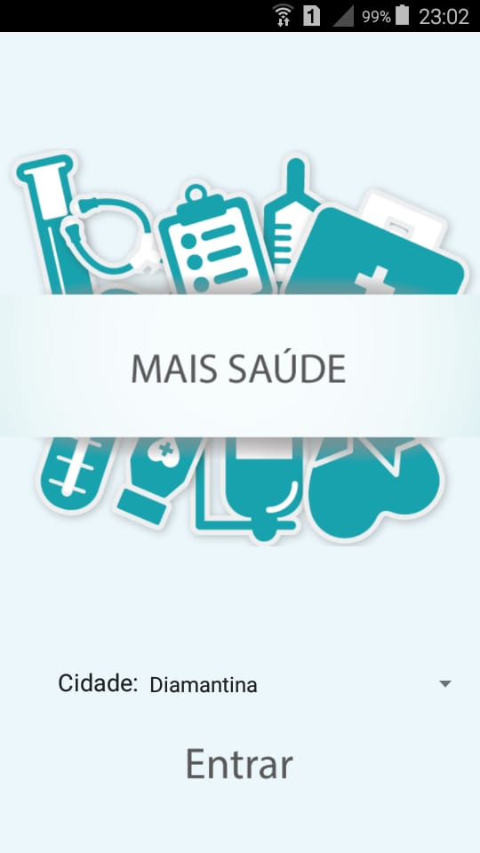
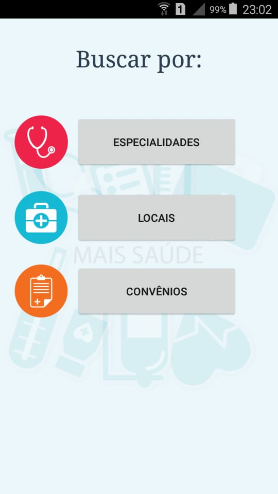
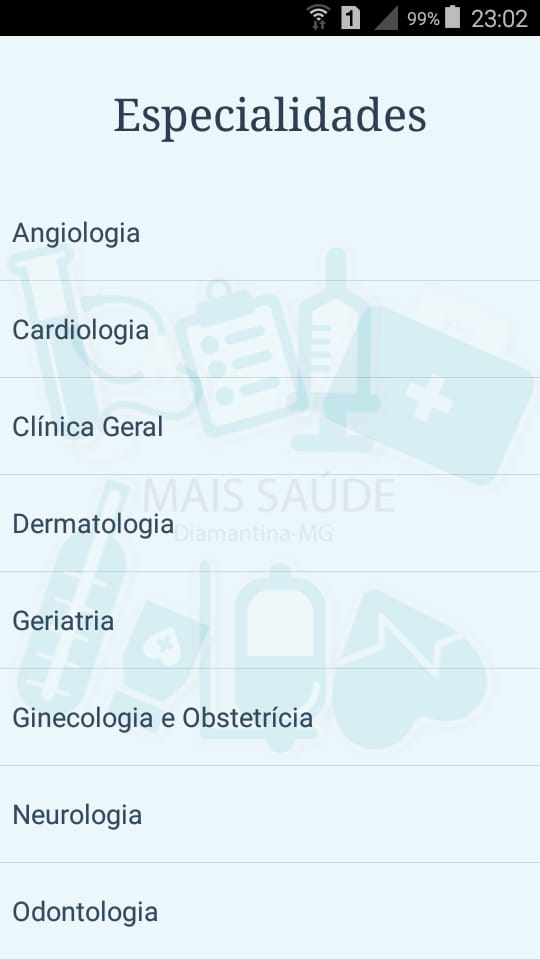
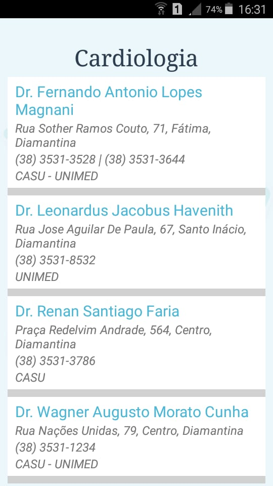
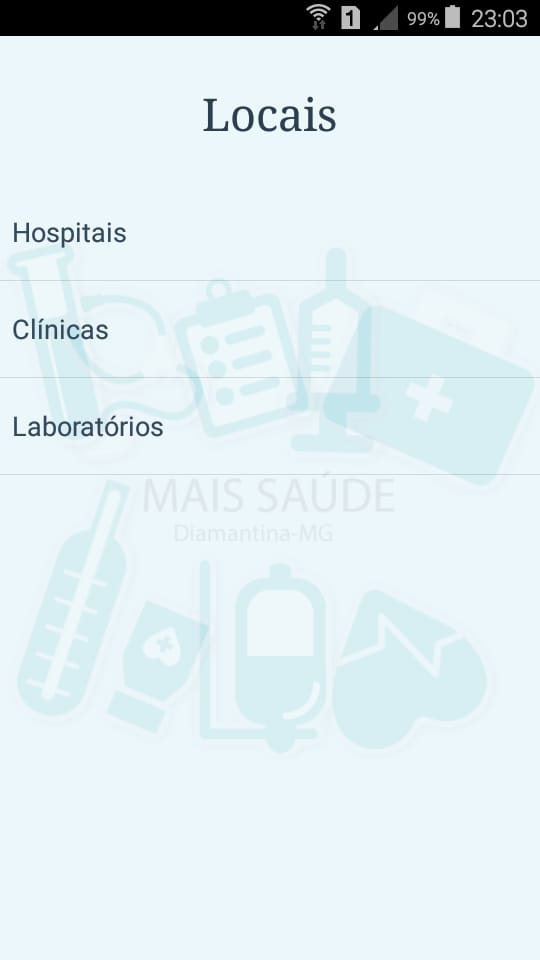
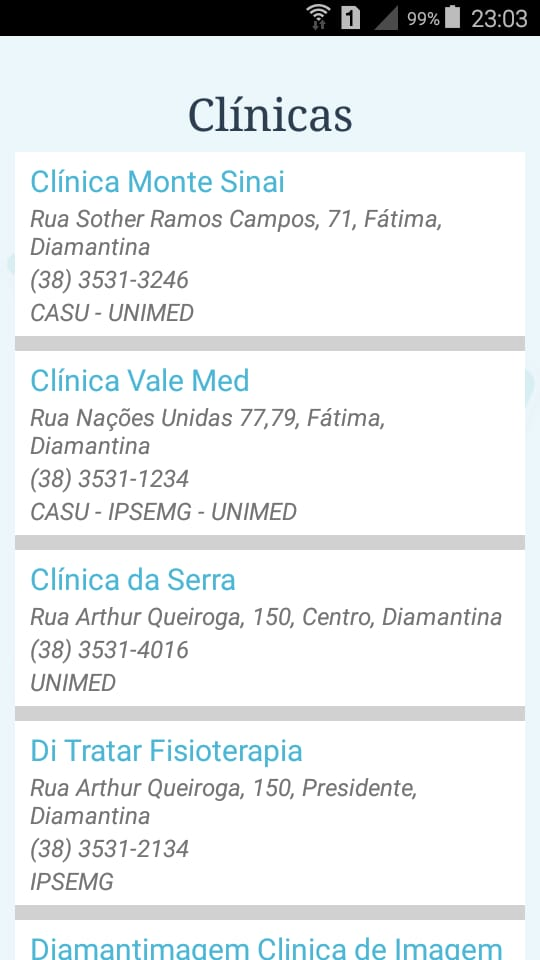
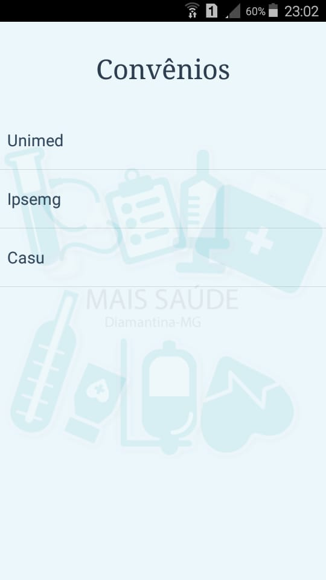
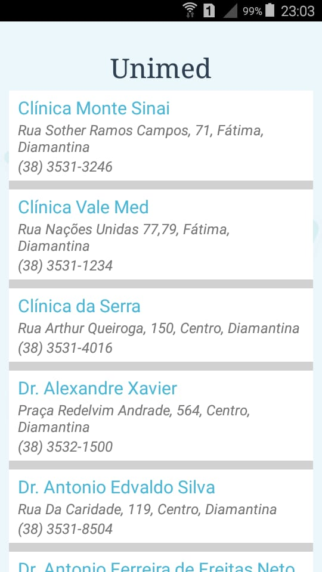

# app_mais_saude
Aplicativo Android desenvolvido para disciplina de Gerência de Projetos de Software. A aplicação consiste em um catálogo de informações sobre contato e localização de consultórios médicos, clínicas, hospitais e laboratórios.

